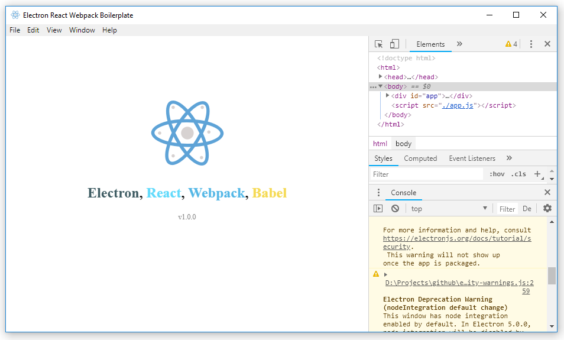

# Electron React Webpack Boilerplate

  This useful boilerplate project uses <a href="http://electron.atom.io/">Electron</a>, <a href="https://facebook.github.io/react/">React</a>, <a href="http://webpack.github.io/docs/">Webpack</a>, <a href="https://babeljs.io/">Babel</a> and <a href="https://github.com/gaearon/react-hot-loader">React Hot Loader</a> (HMR).

 

  
  
  
  

 

## Features

* Electron 4
* Electron Builder
* React 16
* Webpack 4
* Babel 7
* Hot Module Replacement

## Installation

* `git clone https://github.com/hamzaak/electron-react-webpack-boilerplate.git`
* cd electron-react-webpack-boilerplate
* npm install
* npm start

## Packing for distribution

To package the app fro windows platform:

`npm run release:win`

## Maintainer

- [Hamza Ak](https://www.linkedin.com/in/hamzaak/)

## License

MIT